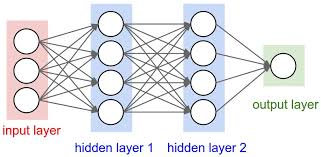

## DEFERED INITIALIZATION

 when working with convolutional neural networks, this technique will become even more convenient since the input dimensionality (i.e., the resolution of an image) will affect the dimensionality of each subsequent layer. Hence, the ability to set parameters without the need to know, at the time of writing the code, what the dimensionality is can greatly simplify the task of specifying and subsequently modifying our models.

Deferred initialization can be convenient, allowing the framework to infer parameter shapes automatically, making it easy to modify architectures and eliminating one common source of errors.We can pass data through the model to make the framework finally initialize parameters.
 ### Why it is essential
 The aim of weight initialization is to prevent layer activation outputs from exploding or vanishing during the course of a forward pass through a deep neural network.
 ### Algorithms
 **Glorot_uniform:**
 
 The Glorot uniform initializer, also called Xavier uniform initializer.
 It draws samples from a uniform distribution within [-limit, limit] where limit is sqrt(6 / (fan_in + fan_out)) where fan_in is the number of input units in the weight tensor     and fan_out is the number of output units in the weight tensor.
 
 **SoftMax:**
 
 The softmax function, also known as softargmax or normalized exponential function is a generalization of the logistic function to multiple dimensions. It is used in multinomial logistic regression and is often used as the last activation function of a neural network to normalize the output of a network to a probability distribution over predicted output classes.

## Implementation

Dataset Used: MNIST Dataset

Code: deep_learning.ipynb

## LAYERS IN NEURAL NETWORK

**INPUT LAYER:**
	The input layer of a neural network is composed of artificial input neurons, and brings the initial data into the system for further processing by subsequent layers of artificial neurons. The input layer is the very beginning of the workflow for the artificial neural network.
  
**HIDDEN LAYER:**
	A hidden layer is located between the input and output of the algorithm, in which the function applies weights to the inputs and directs them through an activation function as the output. In short, the hidden layers perform nonlinear transformations of the inputs entered into the network.
  
**OUTPUT LAYER:**
	The output layer is responsible for producing the final result. There must always be one output layer in a neural network. The output layer takes in the inputs which are passed in from the layers before it, performs the calculations via its neurons and then the output is computed.

## References
https://en.wikipedia.org/wiki/Softmax_function

https://d2l.ai/chapter_deep-learning-computation/deferred-init.html

https://www.tensorflow.org/api_docs/python/tf/compat/v1/keras/initializers/glorot_uniform
