# Decision Tree Algorithm :thinking:

Before going down to the topic, lets learn about **Machine Learning**:
## What is Machine Learning? :confused:
 As per the name Machine(Computers) learn about the data. They apply tools, techniques and algorithms to study(Learning) the patterns hidden in the data to make accurate predictions and deliver the output to the users.
 To learn from the data, there are various ways or types.
### Types of Machine Learning: :shushing_face:
1)**Supervised Learning**: 
The basic idea that goes with is that there is a teacher or supervisor who guides the whole process, Similarly, here we train the machine with labeled to predict the outcome for a newly unseen data. Labeled data means data is already paired with some correct answers.
 2) **Unsupervised Learning**:
Here, we do not train the machine rather we leave the machine to study on its own and discover the hidden patterns in the data. Unsupervised Learning deals with unlabeled data. 

 As mentioned above machine apply some algorithms to study the data, these two types of learning have some algorithms. So, we are here today to learn about **Decision Tree Algorithm** which is a supervised learning.

## Decision Tree Algorithm :deciduous_tree:
The **Decision Tree Algorithm** is similar to the if-else statements in looping. Decision Tree is the graphical representation of answers to our own problems which we come across daily in our life based upon some conditions.

## Example of Decision Tree:
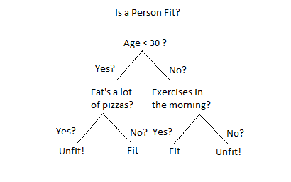

In this example, we want to predict whether a person is fit or unfit with the information provided about their age, eating habits, physical activity, etc. The parent node is the question about his age 'Age < 30?'.The internal nodes are the questions like ‘Does he exercise?’, ‘Does he eat a lot of pizzas’? And the leaves represent outcomes like either ‘fit’, or ‘unfit’.
## Types of Decision Trees:
**1)Classification Trees**:
 The above example is an example of Classification Tree. The outcome variables 'fit' or 'unfit'are the Categorical Variables.
The tree is built through a process called binary recursive partitioning which is an iterative process of splitting the data into partitions, and then splitting it up further on each of the branches.

**2)Regression Trees**:
 In this type of decision trees the target variable can take continuous values or real numbers. Examples:the price of a house, or a patient’s length of stay in a hospital.

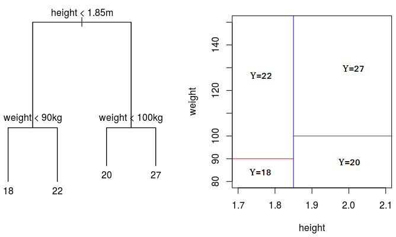

## Terminology related to Decision Tree:
**1)Root Node:** It represents entire population and further gets divided into two or more homogeneous sets. 
**2)Decision Node:** When a sub-node splits into further sub-nodes, then it is called decision node. 
**3)Leaf/ Terminal Node:** Nodes do not split is called Leaf or Terminal node. 
**4)Branch / Sub-Tree:** A sub section of entire tree is called branch or sub-tree. 
**5)Parent and Child Node:** A node, which is divided into sub-nodes is called parent node of sub-nodes where as sub-nodes are the child of parent node.

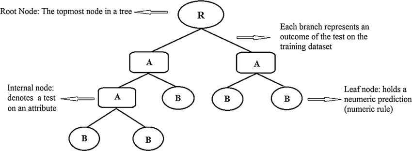

## Attribute Selection Measures:
The primary challenge in the Decision Tree implementation is to identify the attributes which we consider as the root node and each level. This process is known as the attributes selection. There are different attributes selection measure to identify the attribute which can be considered as the root node at each level. 
**1)Entropy**: This tells how messy is our data. It controls how a decision tree decides to split the data. Its value ranges from 0 to 1. The entropy is 0 if all samples of a node belong to the same class (not good for training dataset), and the entropy is maximal if we have a uniform class distribution (good for training dataset). 
 Entropy(D) = Σ - pi(log2(pi))
 Here also p is probability.

**2)Information Gain**: measures how much “information” a feature gives us about the class. The information gain is based on the decrease in entropy after a dataset is split on an attribute. It is the main parameter used to construct a Decision Tree. An attribute with the highest Information gain will be tested/split first. It is the difference between the original information requirement and the new requirement.
 Gain(D,A) = Entropy(D) - Σ(((Dj)/D)*Entropy(Dj))
 D is the given data partition
 A is attribute, an attribute can have V distinct values.

**3)Gini Index**: Another attribute selection measure that CART (Categorical and Regression Trees) uses is the Gini index. It uses the Gini method to create split points.
Gini index can be represented with the following diagram:-

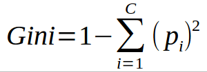

## Classification using ID3 Algorithm:
This algorithm uses entropy and information gain as metric. 
**Example**: Consider whether a dataset based on which we will determine whether to play football or not. 
 
 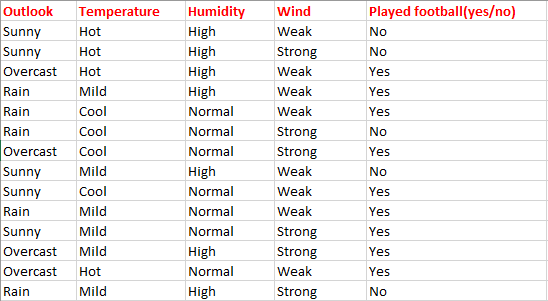
 
There are for independent variables to determine the dependent variable. 
**Independent variables**: Outlook, Temperature, Humidity, and Wind.  
**Dependent variable**: is whether to play football or not.
 
 **Step1: Entropy of the class variable.** 
 E(S) = -[(9/14)log(9/14) + (5/14)log(5/14)] = 0.94 
 Total there are 14 yes/no. Out of which 9 yes and 5 no. Based on it we calculated probability above.
 
 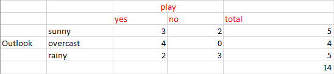
 
 **Step2: To calculate total of weights of each feature multiplied by probabilities.** 
 E(S, outlook) = (5/14)*E(3,2) + (4/14)*E(4,0) + (5/14)*E(2,3) = (5/14)(-(3/5)log(3/5)-(2/5)log(2/5))+ (4/14)(0) + (5/14)((2/5)log(2/5)-(3/5)log(3/5)) = 0.693 
 
**Step3: To find the information gain.** 
It is the difference between parent entropy and average weighted entropy we found above. 
IG(S, outlook) = 0.94 - 0.693 = 0.247 
IG(S, Temperature) = 0.940 - 0.911 = 0.029 
IG(S, Humidity) = 0.940 - 0.788 = 0.152 
IG(S, Windy) = 0.940 - 0.8932 = 0.048 

**Step3: Select the feature having the largest entropy gain.** 
Here it is Outlook. So it forms the first node(root node) of our decision tree.
 

 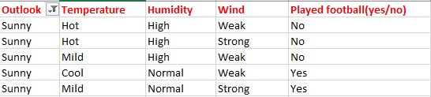
 
 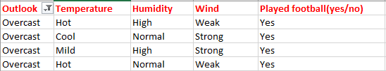
 
 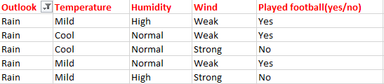
 
 Since overcast contains only examples of class ‘Yes’ we can set it as yes. That means If outlook is overcast football will be played. Now our decision tree looks as follows.
 
 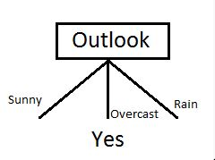
 
 The next step is to find the next node in our decision tree. Now we will find one under sunny. We have to determine which of the following Temperature, Humidity or Wind has higher information gain.

 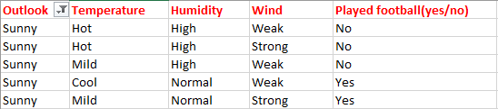
 
 E(sunny) = (-(3/5)log(3/5)-(2/5)log(2/5)) = 0.971.
 
  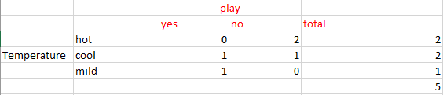
  
 E(sunny, Temperature) = (2/5)*E(0,2) + (2/5)*E(1,1) + (1/5)*E(1,0)=2/5=0.4> 
IG(sunny, Temperature) = 0.971–0.4 = 0.571 
IG(sunny, Humidity) = 0.971 
IG(sunny, Windy) = 0.020 
Here IG(sunny, Humidity) is the largest value. So Humidity is the node that comes under sunny.

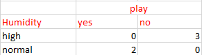
 
 For humidity from the above table, we can say that play will occur if humidity is normal and will not occur if it is high. Finally, our decision tree will look as below:
 
 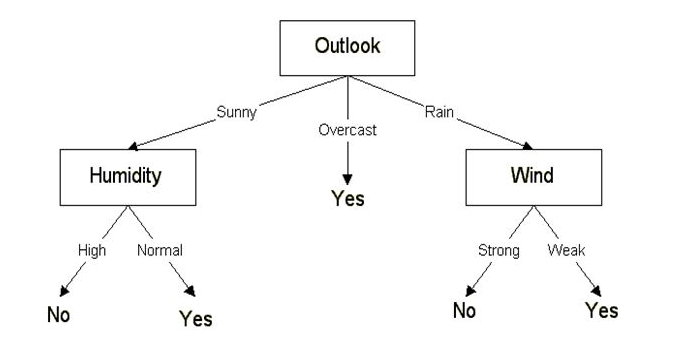
 
## Classification using CART Algorithm:
This algorithm makes use of Gini Index as the metric. 
**Step1: Calculate the Gini index of the class variable** 
Gini(S) = 1 - [(9/14)² + (5/14)²] = 0.4591 

**Step2:Calculate the Gini gain**

Gini(S, outlook) = (5/14)gini(3,2) + (4/14)*gini(4,0)+ (5/14)*gini(2,3) = (5/14)(1 - (3/5)² - (2/5)²) + (4/14)*0 + (5/14)(1 - (2/5)² - (3/5)²)= 0.171+0+0.171 = 0.342 
Gini gain (S, outlook) = 0.459 - 0.342 = 0.117 
Gini gain(S, Temperature) = 0.459 - 0.4405 = 0.0185 
Gini gain(S, Humidity) = 0.459 - 0.3674 = 0.0916 
Gini gain(S, windy) = 0.459 - 0.4286 = 0.0304 
Gini gain is higher for outlook. So we can choose it as our root node. 
Now we have got an idea of how to proceed further. Repeat the same steps we used in the ID3 algorithm.

## Overfitting in Decision Tree:
Overfitting is a practical problem while building a Decision-Tree model. The problem of overfitting is considered when the algorithm continues to go deeper and deeper to reduce the training-set error but results with an increased test-set error. So, accuracy of prediction for our model goes down. It generally happens when we build many branches due to outliers and irregularities in data. 

Two approaches which can be used to avoid overfitting are as follows:- 
**1)Pre-Pruning**: In pre-pruning, we stop the tree construction a bit early. We prefer not to split a node if its goodness measure is below a threshold value. But it is difficult to choose an appropriate stopping point.

**2)Post-Pruning**: In post-pruning, we go deeper and deeper in the tree to build a complete tree. If the tree shows the overfitting problem then pruning is done as a post-pruning step. We use the cross-validation data to check the effect of our pruning. Using cross-validation data, we test whether expanding a node will result in improve or not. If it shows an improvement, then we can continue by expanding that node. But if it shows a reduction in accuracy then it should not be expanded. So, the node should be converted to a leaf node.

## Pros of Decision Tree:
 1)Decision trees are easy to visualize and interpret.
 2)It can easily capture non — linear patterns.
 3)It can handle both numerical and categorical data.

## Cons of Decision Tree:
 1)Overfitting is one of the most practical difficulties for decision tree models.
 2)Low accuracy for continuous variables
 3)It is unstable, meaning that a small change in the data can lead to a large change in the structure of the optimal decision tree.
 4)Decision trees are biased with imbalance dataset, so it is recommended that balance out the dataset before creating the decision tree.

For coding part refer Dibyasha_DesicionTree.ipnyb

Thanks for reading :heart:
  Contributed by **Dibyasha Panda**

 Reach me out at:
 

