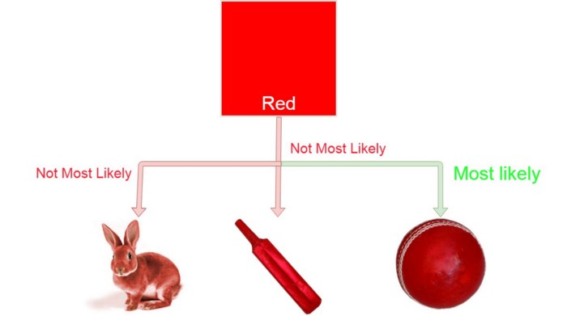
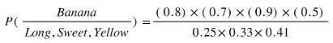
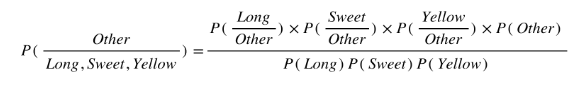
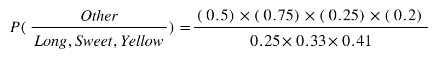
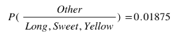

# Naive_Bayes_Classifier
## Classifier: 
A classifier is a machine learning model that is used to discriminate different objects based on certain features. 

A Naive Bayes classifier is just a matter of counting how many times each attribute co-occurs with each class.  
Naive Bayes is a very popular classification algorithm that is mostly used to get the base accuracy of the dataset.

## Why it is called Naive? 
This algorithm makes an assumption as all the variables in the dataset is “Naive” i.e not correlated to each other.

## Principle of Naive Bayes Classifier: 
A Naive Bayes classifier is a probabilistic machine learning model that’s used for classification task. The crux of the classifier is based on the Bayes theorem.

## Bayes Theorem: 

Using Bayes theorem, we can find the probability of A happening, given that B has occurred. Here, B is the evidence and A is the hypothesis. The assumption 
made here is that the predictors/features are independent. That is presence of one particular feature does not affect the other. Hence it is called naive.

### Explanation: 
Suppose we are making a machine and have given the task to classify an object in between bat, ball and a cat. At first we will create a machine that will identify the characters of the object and then map it with the classification objects such that if an object is a circle then it will be a ball or if the object is living-being then it will be a cat or in our case, if our object is red then it is most probable that it will be a ball.

### Formula: 
Here c represents the class eg. ball, cat, bat. 
x represents features calculated individually.

Where,
P(c|x) is the posterior probability of class c given predictor ( features). 
P(c) is the probability of class. 
P(x|c) is the likelihood which is the probability of predictor given class. 
P(x) is the prior probability of predictor. 

## Example: 
We have data on 1000 pieces of fruit. The fruit being a Banana, Orange or some other fruit and imagine we know 3 features of each fruit, whether it’s long or not, sweet or not and yellow or not, as displayed in the table below.

From the table we got to know that 
50% of the fruits are bananas 
30% are oranges 
20% are other fruits 

Based on our training set we can also say the following: 
From 500 bananas 400 (0.8) are Long, 350 (0.7) are Sweet and 450 (0.9) are Yellow 
Out of 300 oranges, 0 are Long, 150 (0.5) are Sweet and 300 (1) are Yellow 
From the remaining 200 fruits, 100 (0.5) are Long, 150 (0.75) are Sweet and 50 (0.25) are Yellow 

Now we need to to predict the class of another fruit. We are given that the additional fruit is Long, Sweet and Yellow, we can classify it using the following formula and subbing in the values for each outcome, whether it’s a Banana, an Orange or Other Fruit. The one with the highest probability (score) being the winner. 

**Banana**:

**Orange**:

**Other Fruit**:

In this case, based on the higher score ( 0.252 for banana ) we can assume this Long, Sweet and Yellow fruit is in fact, a Banana.

## Applications: 
**1)Real time Prediction**: Naive Bayes is an eager learning classifier and it is sure fast. Thus, it could be used for making predictions in real time. 
**2)Multi class Prediction**: This algorithm is also well known for multi class prediction feature. Here we can predict the probability of multiple classes of target variable.  
**3)Text classification/ Spam Filtering/ Sentiment Analysis**: Naive Bayes classifiers mostly used in text classification. It is widely used in Spam filtering (identify 
spam e-mail) and Sentiment Analysis (in social media analysis, to identify positive and negative customer sentiments) 
**4)Recommendation System**: Naive Bayes Classifier and Collaborative Filtering together builds a Recommendation System that uses machine learning and data mining techniques to filter unseen information and predict whether a user would like a given resource or not.

## Adavantages: 
1)It is easy and fast to predict the class of the test data set. It also performs well in multi-class prediction. 
2)When assumption of independence holds, a Naive Bayes classifier performs better compare to other models like logistic regression and you need less training data. 
3)It perform well in case of categorical input variables compared to numerical variable(s). 

## Disadvantages: 
1)If categorical variable has a category (in test data set), which was not observed in training data set, then model will assign a 0 (zero) probability and will be unable to make a prediction. This is often known as “Zero Frequency”. To solve this, we can use the smoothing technique. One of the simplest smoothing techniques is called Laplace estimation. 
2)Naive Bayes is also known as a bad estimator, so the probability outputs from predict_proba are not to be taken too seriously. 
3)Naive Bayes is the assumption of independent predictors. In real life, it is almost impossible that we get a set of predictors which are completely independent. 

Thanks for reading :heart:
  Contributed by **Dibyasha Panda**

 Reach me out at:
 

 

