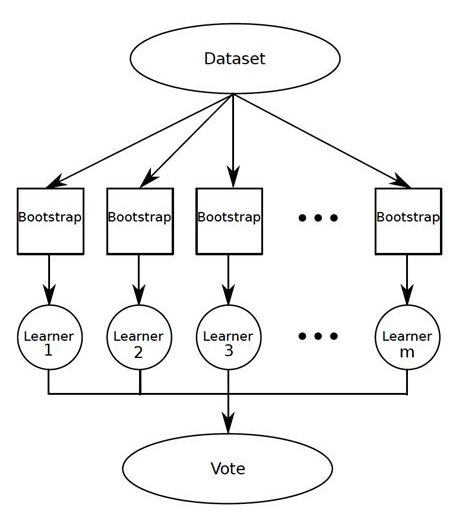
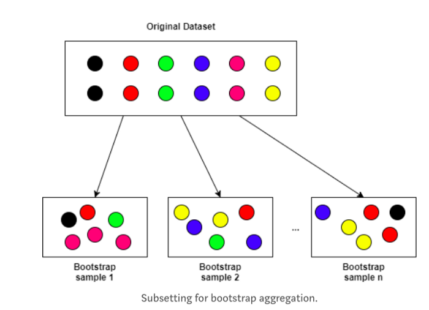
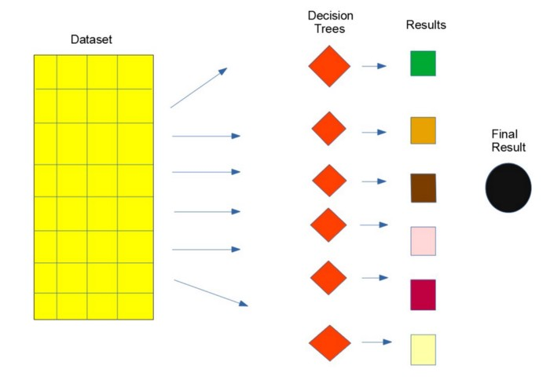

# Random Forest Algorithm :evergreen_tree: :evergreen_tree:
Random forest is a supervised learning algorithm. It has two variations – one is used for classification problems and other is used for regression problems. 
It is one of the most flexible and easy to use algorithm. It creates decision trees on the given data samples, gets prediction from each tree and selects the 
best solution by means of voting. It is also a pretty good indicator of feature importance. 

Random forest algorithm combines multiple decision-trees, resulting in a forest of trees, hence the name Random Forest. In the random forest classifier, the 
higher the number of trees in the forest results in higher accuracy. 

Random Forest is the most popular ensemble model for beginner data scientists.

## Ensemble Model :thinking:
An ensemble model is just an ensemble of many models grouped other.

An ensemble model like Random Forest is just a bunch of decision trees. In the below figure there are 3 decision trees.

Ensemble models like Random Forest are designed to decrease overfitting and variance by using bagging algorithms. 
We know that decision trees are prone to overfitting. In other words, a single decision tree can be wonderful at finding a solution for a specific problem but not useful for the problem it has never seen before, for which we use Ensemble models. 
Ensemble models use many decision trees that are good at their particular task to make a larger model that’s great at many different tasks. 
**Example**: We are more likely to make a good business decision by listening to many employees who have experience rather than listening to the advice of a single employee.

## Bagging Algorithm
Random Forest algorithm mainly follows the techniques of Bagging Algorithms. Bagging Algorithms deal with the weak learners.
### Weak Learners
Weak learners make up the backbone of Random Forest models.

Weak learners are algorithms that predict/classify data with an accuracy. These are useful because we can pool them together to make a larger model whose predictions/classifications are super good. 

Ensemble models like Random Forest use bagging algorithms to overcome high variance and overfitting. 
**Ideology of Bagging Algorithm**: 
They work with random samples of the data with replacement which means the algorithm goes through and builds decision trees with random samples of the data.

## Random Forest Model
Random Forest models use bagging algorithms to build little decision trees, each one of which is built simultaneously with random subsets of the data and each decision tree is independent from other. 
Each tree in a Random Forest model only contain a subset of data, each tree also only uses a subset of features (i.e. columns) from the data. 
**Example**: We are trying to classify a book as sold or unsold based on author, publication date, number of pages, and language. And we have 10,000 books in our dataset. In a Random Forest model, not only would each of our decision trees only use a random sample of the 10,000 books, each decision tree would also only use a random sample of the features: perhaps one decision tree would use author and publication date, while another decision tree would use author and number of pages. And yet another decision tree could use language and publication date. The point of this is that when we average the predictions of all of these decision trees (i.e. “weak learners) together, we get a super robust prediction. 

### Underfitting and Overfitting
An ideal model should be with low bias and low variance. A single decision tree results maybe with low bias and high variance. 

*If the model is with high bias, it leads to the underfitting*. 
*If it is with high variance, it leads to overfitting.* 

**Underfitting** occurs when the model cannot capture data trends. Underfitting happens in classes when the students not covering the given syllabus and perform poorly to the questions come from inside the syllabus as well as outside the syllabus in the exam. 

**Overfitting** occurs when the model fits the training data too well. Overfitting happens in classes when the students study the syllabus very well and writing in exam what they read in the given syllabus to the questions comes from outside the syllabus too.

## Random Forest algorithm intuition 
Random forest algorithm intuition can be divided into two stages. 

In the first stage, we randomly select “k” features out of total m features and build the random forest. In the first stage, we proceed as follows:- 
1)Randomly select k features from a total of m features where k < m. 
2)Among the k features, calculate the node d using the best split point. 
3)Split the node into daughter nodes using the best split. 
4)Repeat 1 to 3 steps until l number of nodes has been reached. 
5)Build forest by repeating steps 1 to 4 for n number of times to create n number of trees. 

In the second stage, we make predictions using the trained random forest algorithm. 
1)We take the test features and use the rules of each randomly created decision tree to predict the outcome and stores the predicted outcome. 
2)Then, we calculate the votes for each predicted target. 
3)Finally, we consider the high voted predicted target as the final prediction from the random forest algorithm.

## Advantages of Random Forest 
1)Random forest algorithm can be used to solve both classification and regression problems. 
2)It is considered as very accurate and robust model because it uses large number of decision-trees to make predictions. 
3)Random forests takes the average of all the predictions made by the decision-trees, which cancels out the biases. So, it does not suffer from the overfitting problem. 
4)Random forest classifier can handle the missing values. There are two ways to handle the missing values. First is to use median values to replace continuous variables and second is to compute the proximity-weighted average of missing values. 
5)Random forest classifier can be used for feature selection. It means selecting the most important features out of the available features from the training dataset.

## Disadvantages of Random Forest 
1)The biggest disadvantage of random forests is its computational complexity. Random forests is very slow in making predictions because large number of decision-trees are used to make predictions. All the trees in the forest have to make a prediction for the same input and then perform voting on it. So, it is a time-consuming process. 
2)The model is difficult to interpret as compared to a decision-tree, where we can easily make a prediction as compared to a decision-tree. 

Thanks for reading :heart:
  Contributed by **Dibyasha Panda**

 Reach me out at:
 

