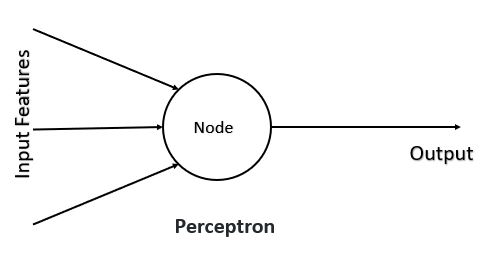
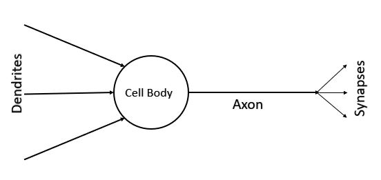
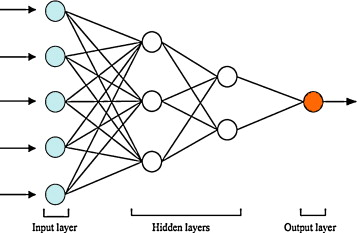
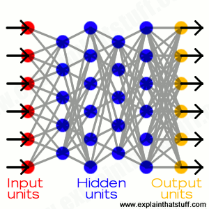
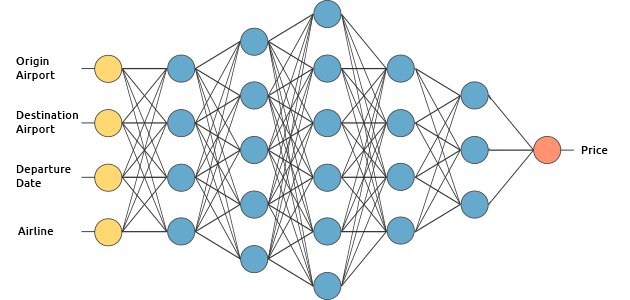

Hello Everyone :wave:

&nbsp;&nbsp;&nbsp;&nbsp;&nbsp;&nbsp;&nbsp;&nbsp; In this blog, we will discuss similarities between biological neural networks and artificial neural networks and see some of the general structure of artificial neural networks.

# Artificial Neurons

&nbsp;&nbsp;&nbsp;&nbsp;&nbsp;&nbsp; Artificial neuron also known as **perceptron** is the basic unit of the *Artificial neural network*. In simple terms, it is a mathematical function based on a model of *biological neurons*.

# Compare with biological neuron

|  |  |
|------------------------------|------------------------------|

In the previous blog, we had seen the biological neuron structure. Let's compare the artificial neural network with it.

* Dendrites are similar to input to the Perceptron or Node.
* The cell body is similar to Node.
* Axon and Synapse are similar to the output from the Node.

The working of an artificial neuron is similar to the biological neuron. The node takes data from the inputs, processes the data, and produces output as per the activation function.

The details of the working neuron we will discuss in the later blogs.

# Artificial Neural Network
&nbsp;&nbsp;&nbsp;&nbsp;&nbsp;&nbsp;&nbsp;&nbsp;The combination of a large number of artificial neurons is known as *Perceptrons* to form an Artificial Neural Network(ANN). 
Several nodes combine to form a Layer.
* The layer from which initial data are provided to the neural network is known as the Input layer.
* The output layer in an artificial neural network is the last layer of neurons that produces given outputs for the program. 
* In between the input layer and output layer, Hidden layers are present which help in determining the complex features.

The structure of a neural network is designed by the programmer as per the model requirement. The structure varies from model to model.
Some general structure of Neural networks is shown below.

      

In this blog, we discussed similarities between biological neural networks and artificial neural networks and saw the different general structure of ANN.
In the next blog, we will see some types of artificial neural networks.

Thank you :smile:

