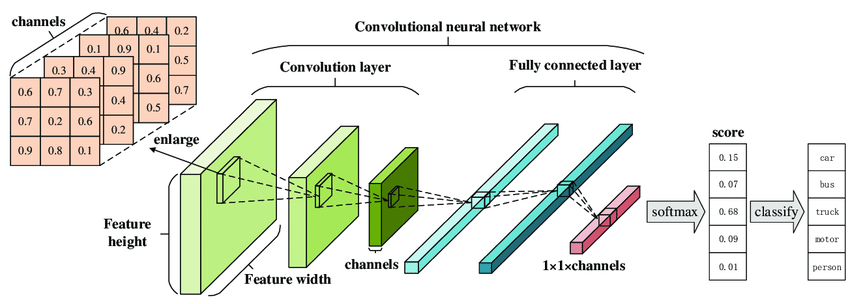
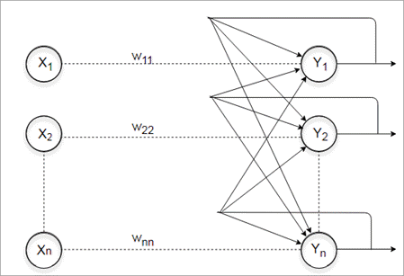

Hello Everyone :wave:

&nbsp;&nbsp;&nbsp;&nbsp;&nbsp;&nbsp;&nbsp;&nbsp; In this blog, we will discuss different types of artificial neural networks. The neural networks are designed by the programmer as per the requirements to solve a particular problem.
Neural Networks are divided into many types, some of them are listed here below:

# Types of Neural Networks
## 1. Feed-Forward Neural Network:

&nbsp;&nbsp;&nbsp;&nbsp;&nbsp;&nbsp;&nbsp;&nbsp;&nbsp;&nbsp;&nbsp;&nbsp;&nbsp;&nbsp;&nbsp;&nbsp;&nbsp;&nbsp;&nbsp;&nbsp;&nbsp;&nbsp;&nbsp;&nbsp;&nbsp;&nbsp;&nbsp;&nbsp;&nbsp;&nbsp;&nbsp;&nbsp;&nbsp;&nbsp;&nbsp;&nbsp;&nbsp;&nbsp;&nbsp;&nbsp;&nbsp;&nbsp;&nbsp;&nbsp;&nbsp;&nbsp;&nbsp;&nbsp; 

&nbsp;&nbsp;&nbsp;&nbsp;&nbsp;&nbsp;&nbsp;&nbsp; The feedforward neural network was the first and simplest type of artificial neural network devised. In this network, the information moves in only one direction—forward—from the input nodes, through the hidden nodes (if any), and to the output nodes. There are no cycles or loops in the network.[[wikipedia]](https://en.wikipedia.org/wiki/Feedforward_neural_network)

Here each node of one layer is connected to all the nodes of the adjacent layer.

## 2. Convolutional Neural Network:

&nbsp;&nbsp;&nbsp;&nbsp;&nbsp;&nbsp;&nbsp;&nbsp;&nbsp;&nbsp;&nbsp;&nbsp; 

&nbsp;&nbsp;&nbsp;&nbsp;&nbsp;&nbsp;&nbsp;&nbsp; The name “convolutional neural network” indicates that the network employs a mathematical operation called convolution. Convolution is a specialized kind of linear operation. Convolutional networks are simply neural networks that use convolution in place of general matrix multiplication in at least one of their layers.[[Wiki]](https://en.wikipedia.org/wiki/Convolutional_neural_network) They are also known as **shift invariant or space invariant artificial neural networks (SIANN).**

The convolutional neural networks are similar to the sliding window algorithm. It is most commonly applied to analyzing visual imagery. A very small matrix as compared to the size of the image is used as a window, it slides over the image to compute new unknown features.

## 3. Recurrent Neural Network:

&nbsp;&nbsp;&nbsp;&nbsp;&nbsp;&nbsp;&nbsp;&nbsp;&nbsp;&nbsp;&nbsp;&nbsp;&nbsp;&nbsp;&nbsp;&nbsp;&nbsp;&nbsp;&nbsp;&nbsp;&nbsp;&nbsp;&nbsp;&nbsp;&nbsp;&nbsp;&nbsp;&nbsp;&nbsp;&nbsp;&nbsp;&nbsp;&nbsp;&nbsp;&nbsp;&nbsp;&nbsp;&nbsp;&nbsp;&nbsp;&nbsp;&nbsp;&nbsp;&nbsp;&nbsp;&nbsp;&nbsp;&nbsp;&nbsp;&nbsp; 

&nbsp;&nbsp;&nbsp;&nbsp;&nbsp;&nbsp;&nbsp;&nbsp; A recurrent neural network is a class of artificial neural networks where connections between nodes form a directed graph along a temporal sequence. This allows it to exhibit temporal dynamic behavior. [[wiki]](https://en.wikipedia.org/wiki/Recurrent_neural_network)

In recurrent neural networks, the output which is generated by the network is given as input to the first hidden layers. This helps in solving some of the more complex problems like unsegmented, connected handwriting recognition or speech recognition, etc..

There are a lot of different types of neural networks are present. The design of the network depends on the requirement of the programmer to solve a particular problem. A network can be designed by a combination of more than one network.

In this blog, we discuss some of the types of neural networks. Next, we will discuss the fundamentals of computation of neurons and its implementation using python programming.

Thank you :smile:
Happy Learning

