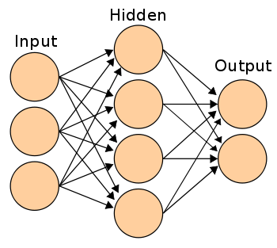

## Multi-Layer Neural Network #3

Welcome back. Let's now peep into some ***advantages of multi-layer neural network over a single-layer neural network***.

1. Multi-layer neural networks afford an opportunity for machines to learn more accurately. That is, the learning accuracy of a multi-layer neural network exceeds that of a single-layer neural network.

    
  A typical single-layer neural network

 

2. Multi-layer neural networks generalize well to a given data. This prevents underfitting in the neural network.

3. While a single-layer neural network can only learn linear functions, a multi-layer neural network can learn non-linear functions. 

    
  A multi-layer neural network with 2 hidden neurons

 

Up next, let's demonstrate this by using a example. I am sure you would like this, cause we are going into code :smiley:. 
