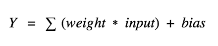
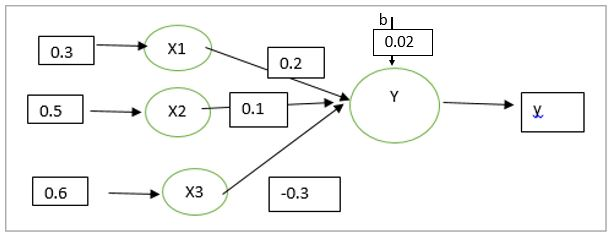

# Hypothesis Function

&nbsp;&nbsp;&nbsp;&nbsp;&nbsp;&nbsp;&nbsp;&nbsp; A hypothesis is a function that best describes the target in supervised machine learning. The hypothesis that an algorithm would come up depends upon the data and also depends upon the restrictions and bias that we have imposed on the data.
In other words, input values are associated with one one weight values and a bias value which is independent of inputs combine to form a hypothesis function.



So the value of h(x) become,
## h(x) = X1\*w1 + X2\*w2 + X3\*w3 + b;

For example, consider the below figure



here, x1 = 0.3, X2 = 0.5, X3 = 0.6, 
w1 = 0.2, w2 = 0.1, w3 = -0.3 and b = 0.02

so, the value of h(x) is
```
h(x) = X1\*w1 + X2\*w2 + X3\*w3 + b
h(x) = 0.3\*0.2 + 0.5\*0.1 + 0.6\*(-0.3) + 0.02
h(x) = -0.05
```

h(x) is given as input to the activation function. As per the result generated by the activation function, the signal is further transmitted.

> At first,  the weights and biases are randomly initialized. By using optimization algorithms, the weights and biases are updated.

In this blog, we see the hypothesis function. The next blog, we will see the program for hypothesis function.


Thank you:smile:

Happy Learning:books:

<p align="right"><a href="2.1.Implementation-of-Hypothesis-Function.ipynb">Next>></a></p>
