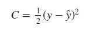

# Cost Function

A simple **cost function** is the minimize the squared error across all the input and output pairs for different values of Weights i.e. w1,w2,...

It is the difference between the actual value and the predicted value generated by the hypothesis function.

&nbsp;&nbsp;&nbsp;&nbsp;&nbsp;&nbsp;&nbsp;&nbsp;&nbsp;&nbsp;&nbsp;&nbsp;&nbsp;&nbsp;&nbsp;&nbsp; 

# Gradient Descent
The backbone of a neural network is Gradient Descent. To write a code for Gradient Descent we need to understand it first. 
Let's say we have a simple linear equation to find solutions for

&nbsp;&nbsp;&nbsp;&nbsp;&nbsp;&nbsp;&nbsp;&nbsp;&nbsp;&nbsp;&nbsp;&nbsp;&nbsp;&nbsp;&nbsp;&nbsp; 

Here we need to find value for w1 and w2 which make the equation true for values given for y, x1 and x2. If we simply guess values of w1 and w2 we will get **y_hat**.

&nbsp;&nbsp;&nbsp;&nbsp;&nbsp;&nbsp;&nbsp;&nbsp;&nbsp;&nbsp;&nbsp;&nbsp;&nbsp;&nbsp;&nbsp;&nbsp; 

We can calculate the error we generated because of guessing the values of w1 and w2 by

&nbsp;&nbsp;&nbsp;&nbsp;&nbsp;&nbsp;&nbsp;&nbsp;&nbsp;&nbsp;&nbsp;&nbsp;&nbsp;&nbsp;&nbsp;&nbsp; 

which we call generally, **Cost**. Now, our objective is to find out the values of w1 and w2 such that **Cost C is minimum**. Cost C is a differentiable function with respect to w1 and w2. From some calculus refresher, if we differentiate (take the derivative of) function C wrt w1 and w2 and equate to 0, we will get the value of w1 and w2 where the cost will reach minima.

&nbsp;&nbsp;&nbsp;&nbsp;&nbsp;&nbsp;&nbsp;&nbsp;&nbsp;&nbsp;&nbsp;&nbsp;&nbsp;&nbsp;&nbsp;&nbsp; 

These derivatives are called **Gradients**. Basically, a Derivative of a function at some point is a **tangent or Gradient** of that function at that point. Looking at the above equations we can not get the value of w1 and w2, where cost derivatives will be 0, as they are dependent on both w1 and w2.

Now to reach at the minima we will start taking small steps towards the direction of minima (which means opposite the direction of Gradient) by updating weights by a small amount each time. In short, we are descending in the opposite direction of tangent or Gradient — that is why the name **“Gradient Descent”**.

&nbsp;&nbsp;&nbsp;&nbsp;&nbsp;&nbsp;&nbsp;&nbsp;&nbsp;&nbsp;&nbsp;&nbsp;&nbsp;&nbsp;&nbsp;&nbsp;

&nbsp;&nbsp;&nbsp;&nbsp;&nbsp;&nbsp;&nbsp;&nbsp;&nbsp;&nbsp;&nbsp;&nbsp;&nbsp;&nbsp;&nbsp;&nbsp;&nbsp;&nbsp;&nbsp;&nbsp;&nbsp;&nbsp;&nbsp;&nbsp;&nbsp;&nbsp;&nbsp;&nbsp;&nbsp;&nbsp;&nbsp;&nbsp;&nbsp;&nbsp;&nbsp;&nbsp;&nbsp;&nbsp;&nbsp;&nbsp;&nbsp;&nbsp;&nbsp;&nbsp;&nbsp;&nbsp;&nbsp;&nbsp;

In the above graph the x-axis=w1 values and y-axis=cost value. The above curve is known as the **"Learning Curve"**.

In the next blog, we will see the implementation of gradient descent.

Thank you:smile:

Happy Learning:books:

<a href="4.1.Implementation-of-Gradient-Descent.ipynb">Next>></a>

