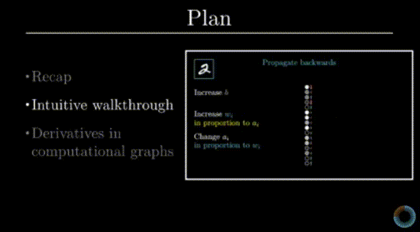

# Backpropagation

Just like gradient descent backpropagation is a process of evaluating the weights and bias values. The mathematics behind the backpropagation is pretty complex. If you are interested to know the detail fundamental then you can see video below. Even if you are not interested then also, I suggest you to go through this video atleast once.

Even without kowning the mathmatics behind the backpropagation you can use different tools and techniques developed by expert to build your own model.

The below are some of the examples of optimization techniques of keras API.

* stochastic gradient descent(sgd)
* Adma optimizer
* RMSprop
* Adadelta
* Adagrad
* Adamax
* Nadam
* Ftrl

Thank you for reading:smile:

Happy Learning:books:

<a href="">Next>></a>

