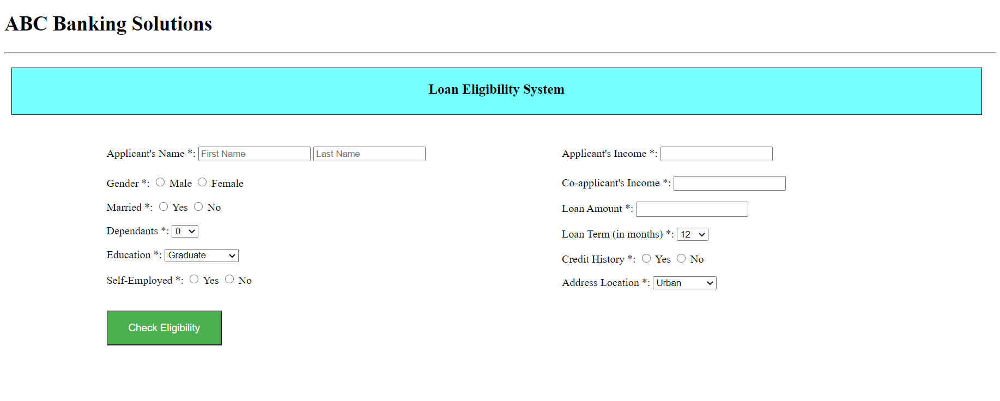
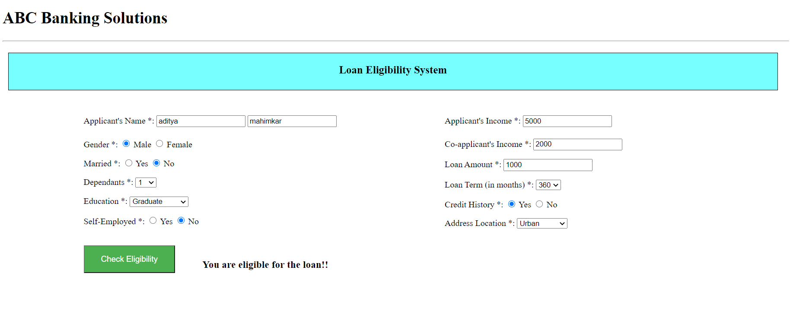
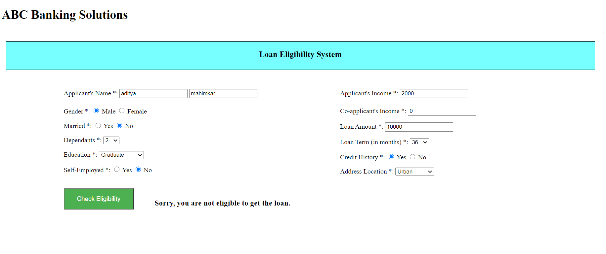

## Problem Statement - Loan Prediction System
To predict whether the customer is eligible for applying a loan application based on various parameters such as gender, maritial status, income, education, employment, loan amount, loan term, and credit history given by user on the website hosted using Flask.

## Machine Learning Algorithm
The outcome is a discrete value of 0(not eligible) or 1(eligible). So **Logistic Regression** is best choice to classify the customer between two classes.

## Dataset
The [dataset](https://www.kaggle.com/altruistdelhite04/loan-prediction-problem-dataset) is consist of 12 columns of which 1 consists of output and one is ID no which of no use.

## Model Deployment
- The dataset is first loaded in jupyter notebook for analysis, cleaning and training of data using Logistic Regression.
- The model after training, is stored using pickle library as loan_model.pkl.
- Now come to the main part of the project, the app.py file.
- First created some simple html file along with some quick and easy css for frontend interface.
- Then in the [app.py](app.py) file, I have created two routes, one for displaying home page where the user inputs the required information.
- This information is fetched from [home.html](https://github.com/aditya9110/Contribution-program/blob/master/ML_models_Flask/Aditya%20Mahimkar/templates/home.html) file to main program using following code snippet:
```py
user_inputs.append(int(request.form.get(value)))
```
Here, request function is used to fetch the data from form in the html with passing the name variable in place of value above, like,
```html
<p class="appincome">
  Applicant's Income *:
  <input type="number" name="app_income" required>
</p>
```
In above html to capture the input for applicant's income, the name is given "app_income", so to fetch the input, the python snippet would be,
```py
input = request.form.get('app_income')
```
- Later the inputs are converted to numpy array and passed to the model to predict.
- Based on the output, according jinja2 syntax is sent to html file to display.

## Output





