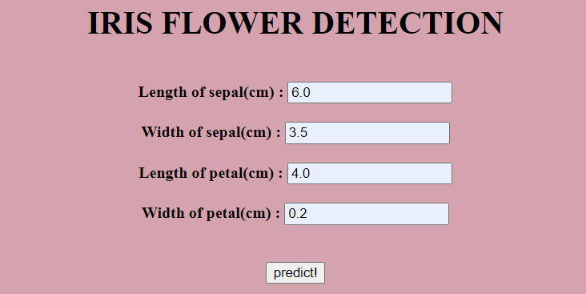
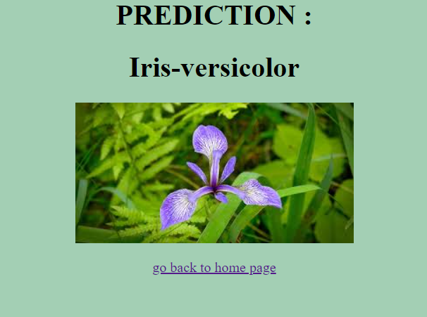

# About Application-

---

This application is **iris flower prediction** machine learning project deployed using flask. It predict the species of the flower by taking some information as input and basis of given input it predict the species of iris flower. In this application it takes 4 input-

- length of sepal(cm)
- width of sepal(cm)
- length of petal(cm)
- width of petal(cm)

and after providing these value our application will give accordingly.


# Model building

---

Model is build using **iris dataset**


### Dataset-

Link-
https://www.kaggle.com/uciml/iris

After building model, the model is saved using **pickle** library.

Then use Flask for Web Server ,


## How Flask works?

First create a web page with flask and connect it to HTML.Anytime any user send information on net or goes to the search bar, the HTML connects the user. The flask framework looks for HTML files (templates) in a folder called Templates. Before sending the template over, Python code is executed which injects variables, code etc.


**more detail explanation in "understanding Model Deployment.md" file**, Please refer to that.

# Algorithm used

---

This model is made by using classification algorithm SVM(Support Vector Machine)

# Requirements-

---

- pandas==1.0.3
- Flask==1.1.1
- numpy==1.18.1
- scikit_learn==0.22.1
- gunicorn==20.0.4


# Structure-

---

1. **templates** - This folder contain the HTML files.

1. **static**- This folder contain static files, like images.

1. **aap.py** - This is a python file where we have built our application.Here, Flask Server is initialise.

1. **iri.pkl** - This is the pickel file ,saved model.

1. **iris.py** - This is a python file where the model is built.

# Running Model-

---

- Create Machine learning Model

  > python iris.py

- Run app to start Flask API

  > python app.py

- You will get a url like-

 http://http://127.0.0.1:5000/


**make sure that you keep your file in same directory**

# Output-





<!--  -->


```python

```
