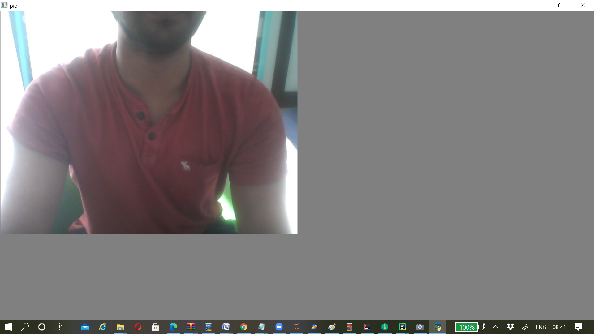
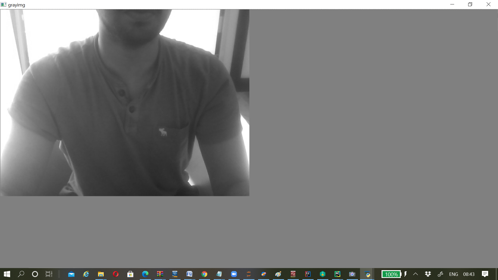
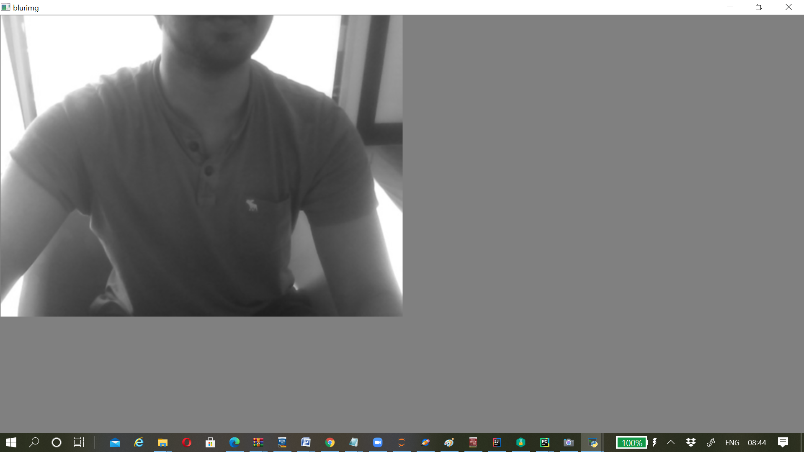
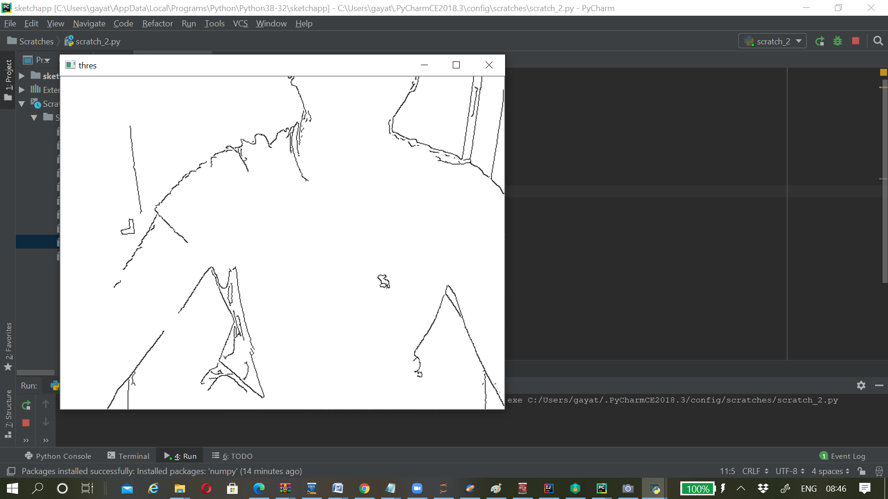

<h1>Sketch App using Webcam</h1>
<h3>Software used</h3><ul><li>Python</li></ul>
<h3>Technical Stack</h3><ul><li>Python libraries : <b>NumPy</b> and <b> OpenCV </b> 
<h3>Numpy</h3>

NumPy stands for "Numerical python". Numpy is a general-purpose array-processing package. It is used for working with arrays and also in the fields like linear algebra,matrices,etc.
Numpy provides a high-performance multidimensional array and basic tools to compute with and manipulate these arrays. Numpy arrays are great alternative to python lists.Numpy arrays are fast,effecient and easy to use.

<h3>OpenCV</h3>

OpenCv stands for "Open Source Computer Vision Library". It is an open source computer vision and machine learning software library. It is widely used in building sterling 
computer vision projects. All the OpenCV array structures are converted to and from Numpy arrays. Using OpenCV library, you can read & write images,Capture & save videos,Process images (filter, transform)
Perform face detection. It is used in the fields of Automobile,Security,Transportation,Robotics,etc.

<h2>Steps to build a Sketch application using webcam</h2>
<ul><li><b>Step 1</b>:</li>

Install NumPy and OpenCV libraries in the python environment using the command prompt.  Enter the following commands: 
<i>pip install numpy</i> 
<i>pip install OpenCV</i>

<li><b>Step 2</b>:</li>

After installing the python libraries we are all set to jump into the code for buliding a basic sketch app
.
<table><tr><th>Python code for Sketch app</th></tr>
<tr><td>import cv2 
import numpy as np  

def sketch(image): 
&nbsp;&nbsp;    <h4># convert the captured image into gray scale image </h4> 
&nbsp;&nbsp;     grayimg=cv2.cvtColor(image,cv2.COLOR_BGR2GRAY) 
&nbsp;&nbsp;     <h4># blurring the image</h4>
&nbsp;&nbsp;     blurimg=cv2.GaussianBlur(grayimg,(3,3),0) 
&nbsp;&nbsp;     <h4># extracting edges</h4>
&nbsp;&nbsp;     edges=cv2.Canny(blurimg,10,80) 
&nbsp;&nbsp;     <h4>#applying threshold</h4>
&nbsp;&nbsp;     ret,mimg=cv2.threshold(edges,50,255,cv2.THRESH_BINARY_INV) 
&nbsp;&nbsp;     return mimg 

<h4># Capturing video from webcam</h4>
vid_capt=cv2.VideoCapture(0) 
<h4># Capturing the video frame by frame</h4>
while True: 
&nbsp;&nbsp;     ret,pic_capt=vid_capt.read() 
&nbsp;&nbsp;     cv2.imshow('Your Sketch',getmysketch(pic_capt)) 
&nbsp;&nbsp;     # Key13 is ENTER_KEY 
&nbsp;&nbsp;     if cv2.waitKey(1)==13: 
&nbsp;&nbsp;         break 
<h4># releasing_webcam</h4>
vid_capt.release() 
<h4># destroying_window</h4>
cv2.destroyAllWindows() </tr></table>

<h2>Step by step explanation</h2>
<table><tr><td>
<i>vid_capt=cv2.VideoCapture(0)</i> 
<i>while True: 
&nbsp;&nbsp;     ret,pic_capt=vid_capt.read() 
&nbsp;&nbsp;     cv2.imshow('Your Sketch',getmysketch(pic_capt)) 
&nbsp;&nbsp;     if cv2.waitKey(1)==13: 
&nbsp;&nbsp;         break </i></td></tr></table>
<ul><li>vid_capt=cv2.VideoCapture(0): It performs the function to open the webcam and to capture the video.</li>
<li>ret,pic_capt=cap.read(): It captures the video frame by frame.</li>
<li>cv2.imshow('Your Sketch',getmysketch(pic_capt)): It pops up a dialog box with the sketch of the frame captured  with the title 'Your Sketch'. To display the sketch it calls the function as shown 'getmysketch(frame)' </li>
<li>if cv2.waitKey(1)==13: 
&nbsp;&nbsp;         break:&nbsp;&nbsp; It breaks the ongoing activity and closes the dialog box after pressing the enter button.</li></ul> 
<table><tr><td>def sketch(image): 
&nbsp;&nbsp;     grayimg=cv2.cvtColor(image,cv2.COLOR_BGR2GRAY) 
&nbsp;&nbsp;     blurimg=cv2.GaussianBlur(grayimg,(3,3),0) 
&nbsp;&nbsp;     edges=cv2.Canny(blurimg,10,80) 
&nbsp;&nbsp;     ret,mimg=cv2.threshold(edges,50,255,cv2.THRESH_BINARY_INV) 
&nbsp;&nbsp;     return mimg </td></tr></table> 

<ul><li>def sketch(image): Function declared with image as a parameter to output the sketch of the captured image.</li>
<li>grayimg=cv2.cvtColor(image,cv2.COLOR_BGR2GRAY): It converts the captured image to gray scale image.We convert the captured image into gray scale image to reduce the complexity or compress i.e An RGB Image consists of 3 layers R,G,B. It’s a 3 dimensional matrix, whereas gray scale image is a 2 dimensional matrix.</li>
<li>blurimg=cv2.GaussianBlur(grayimg,(3,3),0): It blurs the gray scale image obtained through the above operation. It is useful for removing noise. It actually removes high frequency content (eg: noise, edges) from the image.We simply reduce the edge content and makes the transition form one color to the other very smooth 
<li>edges=cv2.Canny(blurimg,10,80): It is executed to extract the edges from the blurred grayscale image.Edge detection is an image processing technique for finding the boundaries of objects within images.It is used to detect a person,license plate or any other things.It works by detecting discontinuities in brightness. It is basically used for image segmentation and data extraction. </li>
<li>ret,mimg=cv2.threshold(edges,50,255,cv2.THRESH_BINARY_INV):Gray scale image is converted into Binary Image, it uses a threshold. Thresholding is a process of converting image to binary form.In OpenCV thresholding is done on grayscale images, which have pixel values ranging from 0–255. When you threshold an image you classify these pixels into groups setting a upper and lower bound to each group.
Suppose gray scale values are from 0 (Pure Black) to 255(Pure White) , values greater than threshold will be converted into 1 (White) and below to threshold will be converted into 0 (Black).</li>
  
  <h3>Image captured through webcam initially</h3>
   
   <h3>Gray scale image</h3>
   
   <h3>Blurred image</h3>
   
  <h3>Edges</h3>
   
  <h3>Threshold image</h3>
   
  <h2>Output</h2>
  
  
  

