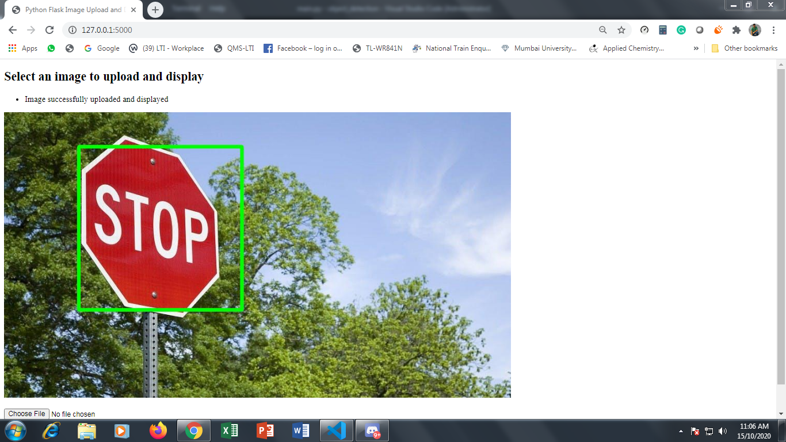

# Object Dtection Deployment Using Flask

## *main.py* file for the flask application
- This file would consist the code that will be used to connect through flask.
- To make different root. 
- There are three root that are created.First one to display opening template. Then for uploading the image that needed to be processed and other for displaying the output.
- The second root consist the code for object detection. 
- Simple stop sign detection code has been written using the haarcascade library. 
  ````         img = cv2.imread(filename) 

        img_gray = cv2.cvtColor(img, cv2.COLOR_BGR2GRAY)

        
        img_rgb = cv2.cvtColor(img, cv2.COLOR_BGR2RGB) 

        stop_data = cv2.CascadeClassifier('stop_data.xml') 
        
        found = stop_data.detectMultiScale(img_gray,  
                                        minSize =(20, 20)) 
        
        # Don't do anything if there's  
        # no sign 
        amount_found = len(found) 
        
        if amount_found != 0: 
            
            
            for (x, y, width, height) in found: 
                
                # every recognized sign 
                cv2.rectangle(img_rgb, (x, y),  
                            (x + height, y + width),  
                            (0, 255, 0), 5)     

  ````

- The image that was generated has type of *<numpy.ndarray>* which is converted to *<str>* class and a .jpg format using the *Pillow* Library. 
  This is done by this lines of code
  
  ````  os.chdir('static/uploads')
        img1 = Image.fromarray(img_rgb, 'RGB')
        img1.save('test.jpg')
        filename = 'test.jpg'
        print(type(filename))
  ````
- The image that is uploaded is saved in a  static/upload folder. Both the detected image and test image is stored in the sam folder. 

## The original image


## The image after detection


